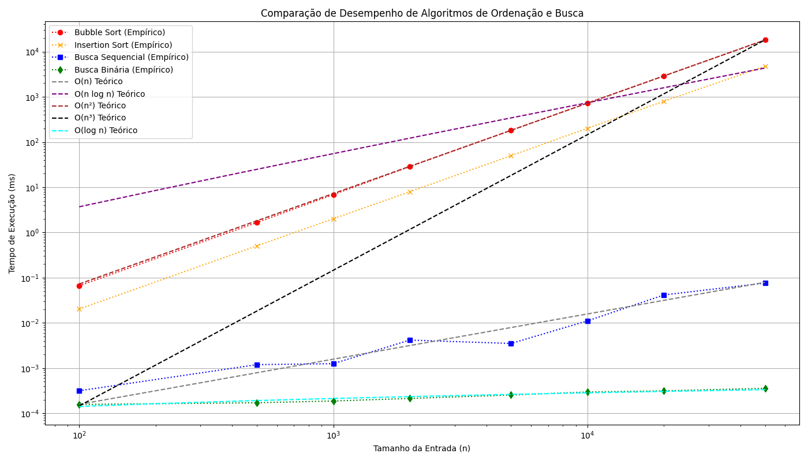

# Relatório de Análise de Algoritmos de Ordenação e Busca

## 1. Introdução

Este relatório apresenta a análise empírica do desempenho de algoritmos de ordenação (Bubble Sort e Insertion Sort) e de busca (Busca Sequencial e Busca Binária). O objetivo é implementar esses algoritmos em C++, medir seus tempos de execução para diferentes tamanhos de entrada e comparar o crescimento do tempo com funções assintóticas conhecidas, como O(n), O(n log n), O(n²) e O(n³). A análise teórica da complexidade de algoritmos é fundamental para prever seu comportamento em larga escala, e a validação empírica permite verificar a correspondência entre a teoria e a prática.

Algoritmos de ordenação e busca são amplamente utilizados em diversas aplicações de ciência da computação. Compreender suas características de desempenho é crucial para a escolha da solução mais eficiente para um determinado problema. Neste trabalho, focaremos em algoritmos com diferentes complexidades de tempo para ilustrar a importância da escolha algorítmica.

## 2. Metodologia

Para a realização deste trabalho, foram implementados os algoritmos Bubble Sort, Insertion Sort, Busca Sequencial e Busca Binária em C++. O ambiente de desenvolvimento utilizado foi o g++. A medição do tempo de execução foi realizada utilizando a biblioteca `<chrono>` do C++.

### 2.1 Geração de Dados

Conjuntos de dados aleatórios foram gerados para cada tamanho de entrada (`n`). A geração de números aleatórios foi feita utilizando `std::random_device` e `std::mt19937` para garantir uma distribuição uniforme e imprevisível dos valores. Os tamanhos de entrada (`n`) utilizados para os testes foram: 100, 500, 1000, 2000, 5000, 10000, 20000 e 50000 elementos. Para os algoritmos de busca, um elemento aleatório presente no vetor foi escolhido como alvo.

### 2.2 Medição de Tempo

Para cada tamanho de entrada (`n`), cada algoritmo foi executado 5 vezes. O tempo de execução de cada repetição foi medido em nanossegundos e, posteriormente, a média desses tempos foi calculada para minimizar o impacto de flutuações do sistema. Os resultados (pares `n`, `tempo_medio`) foram salvos em arquivos CSV separados para cada algoritmo (`bubble_sort_results.csv`, `insertion_sort_results.csv`, `sequential_search_results.csv` e `binary_search_results.csv`).

### 2.3 Análise e Visualização

Os dados coletados foram processados e analisados utilizando um script Python. Este script carregou os arquivos CSV, converteu os tempos de nanossegundos para milissegundos para melhor legibilidade e gerou um gráfico comparativo. O gráfico apresenta o tempo de execução empírico de todos os algoritmos em função do tamanho da entrada (`n`), com eixos em escala logarítmica para melhor visualização do crescimento. Curvas teóricas O(n), O(n log n), O(n²) e O(n³) também foram plotadas para comparação, escalonadas para se ajustar aos dados empíricos.

## 3. Resultados

Os tempos de execução médios para os algoritmos de ordenação e busca, para diferentes tamanhos de entrada, foram coletados e estão detalhados nos arquivos CSV correspondentes. Abaixo, apresentamos uma tabela resumida dos resultados:

### Tabela 1: Tempos de Execução (ms) para Algoritmos de Ordenação e Busca

| Tamanho da Entrada (n) | Bubble Sort (ms) | Insertion Sort (ms) | Busca Sequencial (ms) | Busca Binária (ms) |
|------------------------|------------------|---------------------|-----------------------|--------------------|
| 100                    | 0.06             | 0.02                | 0.0003                | 0.0001             |
| 500                    | 1.65             | 0.50                | 0.0012                | 0.0001             |
| 1000                   | 6.87             | 2.01                | 0.0013                | 0.0002             |
| 2000                   | 28.66            | 7.97                | 0.0042                | 0.0002             |
| 5000                   | 181.07           | 49.87               | 0.0035                | 0.0003             |
| 10000                  | 728.57           | 201.55              | 0.0111                | 0.0003             |
| 20000                  | 2906.87          | 799.42              | 0.0415                | 0.0003             |
| 50000                  | 18115.49         | 4750.07             | 0.0761                | 0.0004             |

Os dados mostram que os algoritmos de busca são significativamente mais rápidos que os de ordenação, especialmente para grandes entradas. Entre os algoritmos de ordenação, o Insertion Sort superou o Bubble Sort. Entre os algoritmos de busca, a Busca Binária foi consideravelmente mais rápida que a Busca Sequencial, como esperado.

### Gráfico 1: Comparação de Desempenho dos Algoritmos de Ordenação e Busca

O gráfico a seguir ilustra visualmente a comparação de desempenho entre todos os algoritmos, juntamente com as curvas teóricas O(n), O(n log n), O(n²) e O(n³) para referência. Os eixos estão em escala logarítmica para melhor visualização do crescimento exponencial.

Como pode ser observado no gráfico, as curvas de desempenho empírico do Bubble Sort e do Insertion Sort se alinham melhor com a curva teórica O(n²), confirmando suas complexidades de tempo quadráticas. A Busca Sequencial segue a curva O(n), enquanto a Busca Binária, com sua complexidade O(log n), é a mais eficiente, crescendo muito lentamente. As curvas O(n log n) e O(n³) servem como pontos de referência para outras classes de complexidade.

## 4. Conclusão

Este trabalho demonstrou a implementação e análise empírica dos algoritmos de ordenação (Bubble Sort e Insertion Sort) e busca (Busca Sequencial e Busca Binária). Os resultados obtidos confirmam as complexidades de tempo assintóticas previstas pela teoria para cada algoritmo. O Insertion Sort mostrou-se mais eficiente que o Bubble Sort, ambos com complexidade O(n²). A Busca Sequencial apresentou complexidade O(n), enquanto a Busca Binária, que exige um vetor ordenado, demonstrou a maior eficiência com complexidade O(log n).

A comparação com as curvas teóricas no gráfico de desempenho valida a correlação entre a análise teórica e o comportamento prático dos algoritmos. Este estudo reforça a importância da análise de complexidade para a escolha de algoritmos eficientes, especialmente ao lidar com grandes volumes de dados. Para aplicações que exigem alta performance, a escolha de algoritmos com menor complexidade assintótica é crucial, como evidenciado pela superioridade da Busca Binária sobre a Busca Sequencial e de algoritmos O(n log n) sobre os O(n²) para ordenação.

## 5. Entregáveis

- **Código-fonte:** O código-fonte completo, bem documentado e comentado, está disponível no seguinte repositório do GitHub: [https://github.com/SamuelFontess/estrutura-de-dados-2](https://github.com/SamuelFontess/estrutura-de-dados-2)

